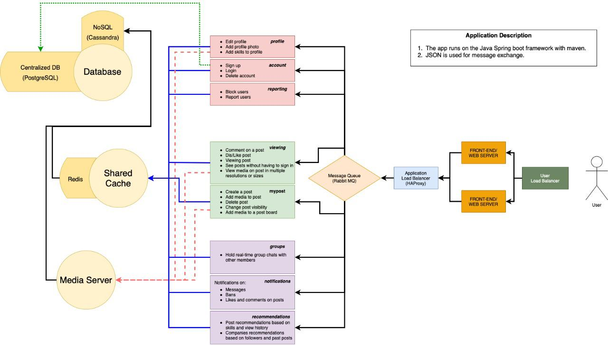

# VeryLinkedIN - a LinkedIN Replica


## Description:

VeryLinkedIN is a replica of the infamous LinkedIN website. Our application is designed to withstand and fully function under heavy loads. Our scalable application was built using Java Spring Boot with a microservices architecture and follows command design pattern. Each service is decoupled so that our microservices run independently. The services run dynamically using the concept of reflection.


## Technologies:

### Framework
- Java Spring Boot

### Queues (Internal Communication)
- RabbitMQ

### Deployment
- Docker
- Kubernetes

### Databases
- Redis
- MongoDB
- PostgresQL

### Testing
- JUnit 5
- Artillery


## Architecture

```
```



```
```
## Teams

### Subteam 1

- Account
- Profile
- Reporting

### Subteam 2

- MyPost
- ViewPost

### Subteam 3

- Groups
- Core
- Notifications
